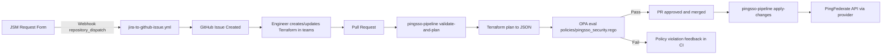
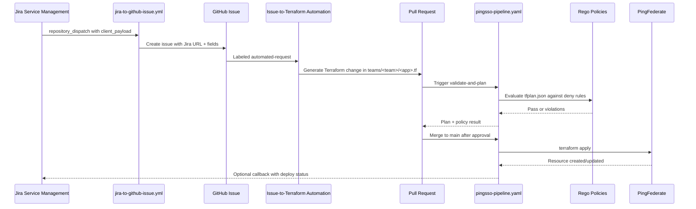
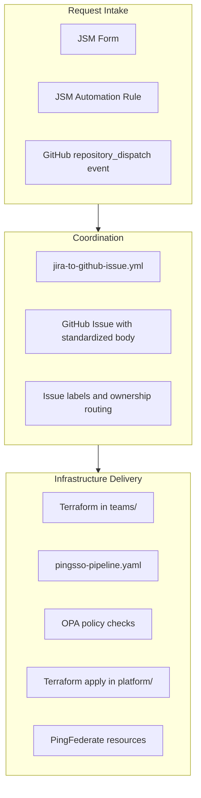

# Jira Service Management to GitHub Issue Solution Design

Document version: 1.0  
Last updated: March 31, 2026  
Owner: Platform Engineering

## 1. Problem Statement

Application teams submit PingFederate redirect URI and SSO onboarding requests in Jira Service Management (JSM), but infrastructure changes are delivered through Terraform in GitHub. Without a deterministic bridge from JSM requests to GitHub-driven Infrastructure as Code (IaC), teams face:

- Manual copying of ticket data into GitHub and Terraform definitions
- Inconsistent data quality across environments (dev, test, stage, prod)
- Delays in change implementation and approvals
- Security risk if URI validation is skipped or applied too late
- Limited traceability from service request to deployed PingFederate configuration

This repository already contains key building blocks:

- Jira webhook intake workflow: .github/workflows/jira-to-github-issue.yml
- Terraform deployment and policy gating workflow: .github/workflows/pingsso-pipeline.yaml
- PingFederate reusable module: modules/pingsso_application/
- OPA policy guardrails: policies/pingsso_security.rego

The remaining challenge is designing the full operating model that connects JSM tickets to GitHub issues, Terraform changes, policy checks, approvals, and PingFederate deployment in a consistent and auditable way.

## 2. Executive Summary

This design introduces a controlled intake-to-deploy path:

1. JSM emits a webhook payload with application metadata and requested redirect URIs.
2. .github/workflows/jira-to-github-issue.yml creates a standardized GitHub issue that preserves all request fields and the Jira URL.
3. A triage or automation step converts the issue into Terraform changes in teams/ using modules/pingsso_application.
4. .github/workflows/pingsso-pipeline.yaml validates, plans, and enforces policy through OPA before merge.
5. On merge to main, Terraform apply provisions or updates PingFederate resources.

Business outcomes:

- Faster delivery for SSO configuration changes
- Strong security controls before production apply
- Full traceability from Jira key to Git commit, PR, Terraform plan, and PingFederate change
- Consistent configuration patterns across OIDC and SAML applications

## 3. Design

### 3.1 Current-State Technical Flow



### 3.2 Target-State Technical Flow (Recommended)



### 3.3 Logical Architecture



### 3.4 Data Contract for Jira Payload

Expected payload keys based on .github/workflows/jira-to-github-issue.yml:

- issue_key
- jsm_url
- summary
- reporter
- fields.team_name
- fields.app_name
- fields.app_type
- fields.dev_redirect_uris
- fields.test_redirect_uris
- fields.stage_redirect_uris
- fields.prod_redirect_uris

Design recommendation:

- Treat issue_key as immutable correlation id.
- Store jsm_url in issue body and PR description.
- Validate app_type against allowed values OIDC or SAML.
- Normalize redirect URI fields into list format before Terraform generation.

### 3.5 Terraform Mapping Strategy

For OIDC requests:

- Create or update a module block under teams/{team}/{app}.tf
- Use source ../../modules/pingsso_application
- Set protocol to OIDC
- Map redirect URIs from environment-specific JSM fields
- Include attribute_mapping default or explicit map

For SAML requests:

- Use protocol SAML
- Map entity_id and acs_url from approved request fields
- Map attribute contracts through attribute_mapping

Policy controls are enforced by policies/pingsso_security.rego at plan time:

- HTTPS required
- Localhost blocked
- OIDC grant type validation
- Attribute mapping presence checks

### 3.6 Operational Workflow

1. JSM request is submitted and approved in service workflow.
2. Webhook triggers jira-to-github-issue workflow.
3. GitHub issue is created with redirect URI details and Jira backlink.
4. Automation bot (or engineer) creates Terraform PR using module template.
5. CI runs terraform validate and terraform plan.
6. CI runs OPA evaluation against tfplan.json.
7. If checks pass and reviewers approve, PR merges to main.
8. Apply job runs and updates PingFederate.
9. Deployment result is posted back to issue and optionally to Jira.

### 3.7 Security, Compliance, and Audit

- Security policy gate runs before merge and blocks non-compliant URIs.
- GitHub branch protection controls who can approve and merge.
- Git history provides immutable audit of requested and applied changes.
- Jira key in issue and PR enables full traceability chain.
- Environment secrets remain in GitHub Secrets and Variables, not in Terraform code.

## 4. Testing

### 4.1 Test Objectives

- Prove JSM payloads are ingested and transformed correctly.
- Prove non-compliant URI requests are blocked before apply.
- Prove compliant requests create expected PingFederate resources.
- Prove traceability from Jira ticket to deployment outcome.

### 4.2 Test Levels

1. Contract testing for webhook payload

- Send repository_dispatch with complete and minimal payloads.
- Verify issue body includes all mandatory fields.
- Verify missing fields fail with clear action logs.

1. Terraform static and plan testing

- Run terraform validate for generated .tf files.
- Run terraform plan and ensure expected resources appear.

1. Policy testing

- Run opa eval with known pass and fail plans.
- Include negative tests for http and localhost redirect URIs.

1. Integration testing in test/ environment

- Use test/main.tf and example tfvars to apply representative OIDC and SAML cases.
- Verify PingFederate objects are created and attribute mappings are correct.

1. End-to-end testing

- From JSM submission through issue creation, PR generation, merge, apply, and status callback.

### 4.3 Suggested Test Matrix

| Scenario                       | Protocol | Expected Result                          |
| ------------------------------ | -------- | ---------------------------------------- |
| Valid OIDC with HTTPS URIs     | OIDC     | Plan and apply succeed                   |
| OIDC with localhost URI        | OIDC     | OPA deny, merge blocked                  |
| Valid SAML ACS URL HTTPS       | SAML     | Plan and apply succeed                   |
| SAML ACS with HTTP             | SAML     | OPA deny, merge blocked                  |
| Unsupported grant type         | OIDC     | OPA deny or Terraform validation failure |
| Missing required payload field | Any      | Issue creation workflow fails fast       |

### 4.4 Release Readiness Criteria

- All contract, policy, and integration tests pass.
- Pull request includes Jira reference and reviewer approval.
- No high severity policy exceptions.
- Rollback procedure validated (revert commit and rerun apply).

## 5. Appendix

### A. Key Repository Assets

- Intake workflow: .github/workflows/jira-to-github-issue.yml
- Deployment workflow: .github/workflows/pingsso-pipeline.yaml
- Terraform module: modules/pingsso_application/main.tf
- Module inputs: modules/pingsso_application/variables.tf
- Security policy: policies/pingsso_security.rego
- Test harness: test/main.tf

### B. Example JSM to Terraform Field Mapping

| JSM Field                 | GitHub Issue Section      | Terraform Field                      |
| ------------------------- | ------------------------- | ------------------------------------ |
| fields.team_name          | Team Name                 | teams directory name                 |
| fields.app_name           | Application Name          | module app_name                      |
| fields.app_type           | Application Type          | module protocol                      |
| fields.oidc_grant_types   | OIDC Grant Types          | oidc_config.grant_types              |
| fields.saml_entity_id     | SAML Entity ID            | saml_config.entity_id                |
| fields.saml_acs_url       | SAML ACS URL              | saml_config.acs_url                  |
| fields.dev_redirect_uris  | Development Redirect URIs | oidc_config.redirect_uris (dev set)  |
| fields.prod_redirect_uris | Production Redirect URIs  | oidc_config.redirect_uris (prod set) |
| jsm_url                   | JIRA Ticket URL           | metadata tag or PR body reference    |

### C. Recommended Next Enhancements

1. Add explicit attribute-mapping fields to JSM form and auto-generate module attribute_mapping from request data.
2. Add environment-specific policy bundles for dev versus prod URI strictness.
3. Add automated drift detection schedule for PingFederate resources.
4. Add automatic rollback PR generation if apply fails in production.
5. Add support for Jira workflow branching rules by request category.

### D. Required Jira Service Management Form Fields

To enable end-to-end automation from JSM to GitHub issue and Terraform delivery, the JSM request type should include the following required fields.

| JSM Form Field Label | Payload Key | Required | Type | Example | Notes |
| --- | --- | --- | --- | --- | --- |
| Jira Issue Key | issue_key | Yes | Text | IAM-1423 | Primary correlation id for audit and callbacks |
| JSM Ticket URL | jsm_url | Yes | URL | <https://company.atlassian.net/servicedesk/customer/portal/12/IAM-1423> | Added to issue body for traceability |
| Request Summary | summary | Yes | Text | Add redirect URIs for Payroll portal | Used for issue context and PR title generation |
| Reporter | reporter | Yes | Text | <jane.doe@company.com> | Used for routing and approvals |
| Team Name | fields.team_name | Yes | Select/Text | hr-platform | Maps to teams directory and ownership |
| Application Name | fields.app_name | Yes | Text | payroll-portal | Maps to Terraform app_name |
| Application Type | fields.app_type | Yes | Select | OIDC or SAML | Must map to module protocol |
| OIDC Grant Types | fields.oidc_grant_types | Conditional | Multiline Text | AUTHORIZATION_CODE | Required when app_type is OIDC |
| SAML Entity ID | fields.saml_entity_id | Conditional | Text | <https://sp.vendor.com/saml2> | Required when app_type is SAML |
| SAML ACS URL | fields.saml_acs_url | Conditional | URL | <https://sp.vendor.com/sso/consume> | Required when app_type is SAML; must be HTTPS |
| Dev Redirect URIs | fields.dev_redirect_uris | Conditional | Multiline Text | <https://dev.payroll.example.com/callback> | Required for OIDC requests |
| Test Redirect URIs | fields.test_redirect_uris | Conditional | Multiline Text | <https://test.payroll.example.com/callback> | Required when test environment is requested |
| Stage Redirect URIs | fields.stage_redirect_uris | Conditional | Multiline Text | <https://stage.payroll.example.com/callback> | Required when stage environment is requested |
| Prod Redirect URIs | fields.prod_redirect_uris | Conditional | Multiline Text | <https://payroll.example.com/callback> | Required for production onboarding |

Additional recommended JSM fields for stronger automation quality:

- Attribute Mapping JSON or key-value list
- Change risk level and implementation window

### E. Implemented Automation

The following automation capabilities are implemented in this repository:

- Payload schema validation in .github/workflows/jira-to-github-issue.yml, including protocol-specific required fields.
- Issue-to-PR automation in .github/workflows/issue-to-terraform-pr.yml to generate Terraform changes in teams/ and open or update pull requests.
- Manual parser preview in .github/workflows/issue-to-terraform-dry-run.yml to validate and generate Terraform output without creating a pull request.
- Jira callback status updates after successful apply in .github/workflows/pingsso-pipeline.yaml, including deployment comment and optional transition.

### F. Sample Jira Webhook Payload

Use this sample payload for Jira Automation when calling GitHub repository dispatch.

```json
{
  "event_type": "jira-uri-request",
  "client_payload": {
    "issue_key": "IAM-1423",
    "jsm_url": "https://company.atlassian.net/servicedesk/customer/portal/12/IAM-1423",
    "summary": "Add production redirect URI for payroll portal",
    "reporter": "jane.doe@company.com",
    "fields": {
      "team_name": "hr-platform",
      "app_name": "payroll-portal",
      "app_type": "OIDC",
      "oidc_grant_types": "AUTHORIZATION_CODE\nREFRESH_TOKEN",
      "dev_redirect_uris": "https://dev.payroll.example.com/callback",
      "test_redirect_uris": "https://test.payroll.example.com/callback",
      "stage_redirect_uris": "https://stage.payroll.example.com/callback",
      "prod_redirect_uris": "https://payroll.example.com/callback",
      "saml_entity_id": "",
      "saml_acs_url": ""
    }
  }
}
```

### G. Sample Jira Webhook Payload (SAML)

```json
{
  "event_type": "jira-uri-request",
  "client_payload": {
    "issue_key": "IAM-1650",
    "jsm_url": "https://company.atlassian.net/servicedesk/customer/portal/12/IAM-1650",
    "summary": "Onboard vendor SAML application",
    "reporter": "john.smith@company.com",
    "fields": {
      "team_name": "enterprise-apps",
      "app_name": "vendor-benefits-portal",
      "app_type": "SAML",
      "oidc_grant_types": "",
      "dev_redirect_uris": "",
      "test_redirect_uris": "",
      "stage_redirect_uris": "",
      "prod_redirect_uris": "",
      "saml_entity_id": "https://sp.vendor-benefits.com/saml2",
      "saml_acs_url": "https://sp.vendor-benefits.com/sso/consume"
    }
  }
}
```

### H. Jira Automation Rule Recipe

1. Trigger: Issue created or Issue transitioned to Approved.
1. Condition: Request type equals PingFederate onboarding request.
1. Action: Send web request.

- Method: `POST`
- URL: `https://api.github.com/repos/<owner>/<repo>/dispatches`
- Headers:
  - `Accept: application/vnd.github+json`
  - `Authorization: Bearer <github-pat-with-repo-scope>`
  - `X-GitHub-Api-Version: 2022-11-28`
  - `Content-Type: application/json`

1. Body template:

Use `.value` for single-select dropdowns and a loop for multi-select values to avoid sending Jira option IDs.

- Single-select dropdown pattern: `{{issue.customfield_12345.value}}`
- Multi-select dropdown pattern: `{{#issue.customfield_12345}}{{value}}{{^last}},{{/}}{{/}}`

```json
{
  "event_type": "jira-uri-request",
  "client_payload": {
    "issue_key": "{{issue.key}}",
    "jsm_url": "{{issue.url}}",
    "summary": "{{issue.summary}}",
    "reporter": "{{issue.reporter.emailAddress}}",
    "fields": {
      "team_name": "{{issue.customfield_team_name.value}}",
      "app_name": "{{issue.customfield_app_name.value}}",
      "app_type": "{{issue.customfield_app_type.value}}",
      "oidc_grant_types": "{{#issue.customfield_oidc_grant_types}}{{value}}{{^last}},{{/}}{{/}}",
      "dev_redirect_uris": "{{issue.customfield_dev_redirect_uris}}",
      "test_redirect_uris": "{{issue.customfield_test_redirect_uris}}",
      "stage_redirect_uris": "{{issue.customfield_stage_redirect_uris}}",
      "prod_redirect_uris": "{{issue.customfield_prod_redirect_uris}}",
      "saml_entity_id": "{{issue.customfield_saml_entity_id}}",
      "saml_acs_url": "{{issue.customfield_saml_acs_url}}"
    }
  }
}
```

### I. Final Resolved Body Template (Replace Field IDs)

Copy this JSON into Jira Automation after replacing each `CUSTOMFIELD_*` token with your actual field ID value (for example `12345`).

```json
{
  "event_type": "jira-uri-request",
  "client_payload": {
    "issue_key": "{{issue.key}}",
    "jsm_url": "{{issue.url}}",
    "summary": "{{issue.summary}}",
    "reporter": "{{issue.reporter.emailAddress}}",
    "fields": {
      "team_name": "{{issue.customfield_CUSTOMFIELD_TEAM_NAME.value}}",
      "app_name": "{{issue.customfield_CUSTOMFIELD_APP_NAME.value}}",
      "app_type": "{{issue.customfield_CUSTOMFIELD_APP_TYPE.value}}",
      "oidc_grant_types": "{{#issue.customfield_CUSTOMFIELD_OIDC_GRANT_TYPES}}{{value}}{{^last}},{{/}}{{/}}",
      "dev_redirect_uris": "{{issue.customfield_CUSTOMFIELD_DEV_REDIRECT_URIS}}",
      "test_redirect_uris": "{{issue.customfield_CUSTOMFIELD_TEST_REDIRECT_URIS}}",
      "stage_redirect_uris": "{{issue.customfield_CUSTOMFIELD_STAGE_REDIRECT_URIS}}",
      "prod_redirect_uris": "{{issue.customfield_CUSTOMFIELD_PROD_REDIRECT_URIS}}",
      "saml_entity_id": "{{issue.customfield_CUSTOMFIELD_SAML_ENTITY_ID}}",
      "saml_acs_url": "{{issue.customfield_CUSTOMFIELD_SAML_ACS_URL}}"
    }
  }
}
```

Example replacement:

- `{{issue.customfield_CUSTOMFIELD_TEAM_NAME.value}}` becomes `{{issue.customfield_12345.value}}`
- `{{#issue.customfield_CUSTOMFIELD_OIDC_GRANT_TYPES}}{{value}}{{^last}},{{/}}{{/}}` becomes `{{#issue.customfield_23456}}{{value}}{{^last}},{{/}}{{/}}`
